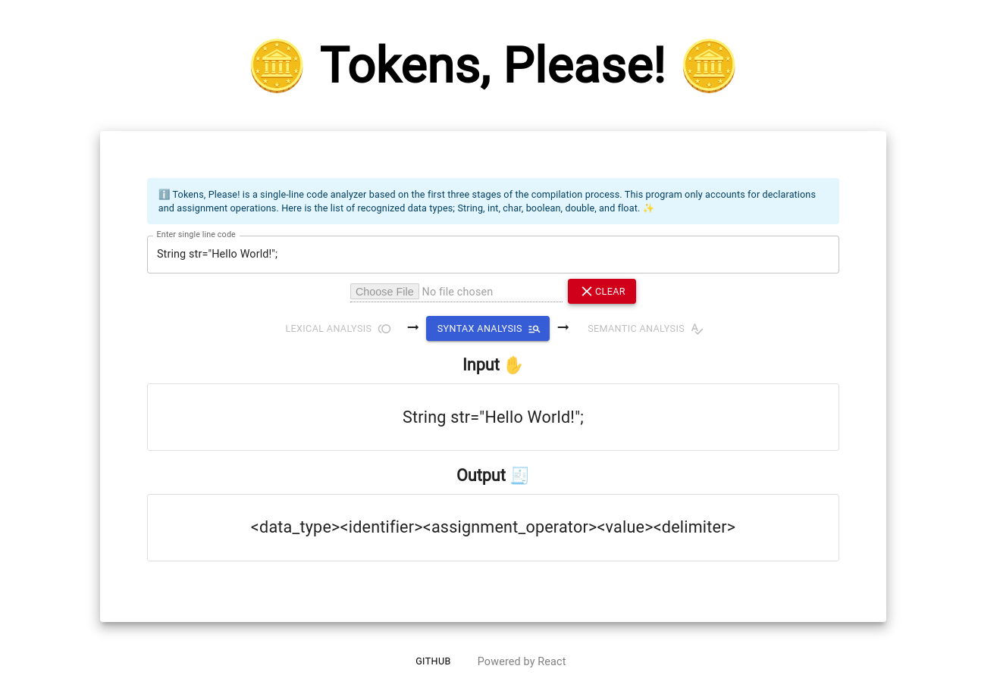
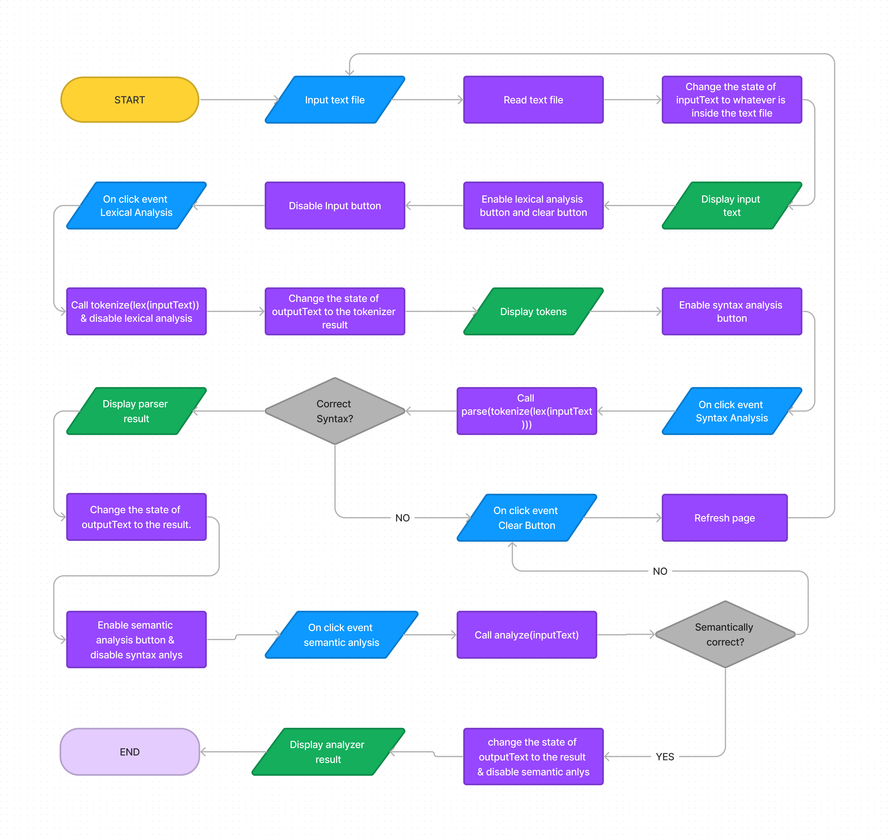

<a href="#" > <a/>
A single line code analyzer based on the first three stages of the compilation process; Lexical Analysis, Syntax Analysis, and Semantic Analysis.

# Group 11 Members
* Arthur
* Rejina
* William

# Preview

# Getting started

1. Setup your text editor, preferably Visual Studio Code
2. Install node from nodejs.org
3. Clone this repository
4. Open the terminal from the directory where the repository has been installed.
5. Run `npm install`
6. Run `npm start`

# Program Flowchart

